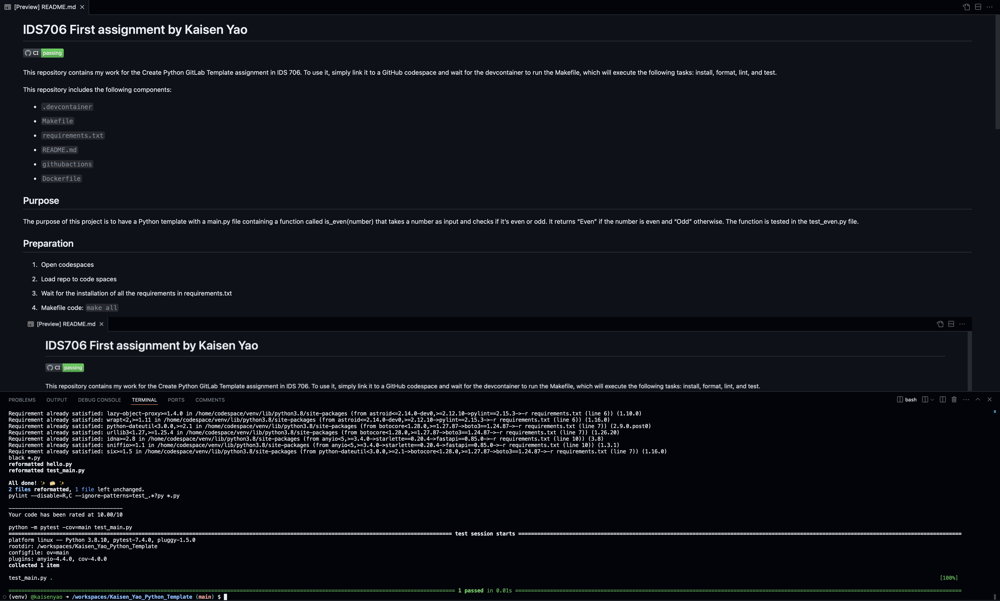

# IDS706 First assignment by Kaisen Yao

This repository contains my work for the Create Python GitLab Template assignment in IDS 706. To use it, simply link it to a GitHub codespace and wait for the devcontainer to run the Makefile, which will execute the following tasks: install, format, lint, and test.

This repository includes the following components:

* `.devcontainer`

* `Makefile`

* `requirements.txt`

* `README.md` 

* `githubactions` 

* `Dockerfile`

## Purpose
The purpose of this project is to have a Python template with a main.py file containing a function called is_even(number) that takes a number as input and checks if it’s even or odd. It returns “Even” if the number is even and “Odd” otherwise. The function is tested in the test_even.py file.

## Preparation
1. Open codespaces

2. Load repo to code spaces

3. Wait for the installation of all the requirements in requirements.txt

4. Makefile code: `make all`

